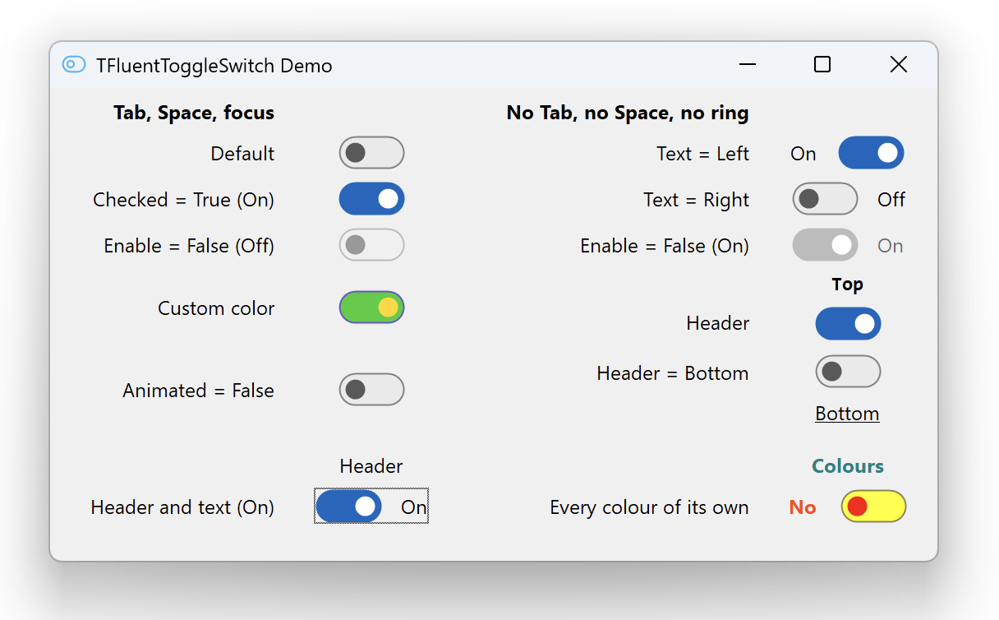

# TFluentToggleSwitch - Windows 11 toggle switch for the VCL


[](https://github.com/Abduction-Lamp/FluentToggleSwitch-VCL/releases/latest) [](LICENSE)

TFluentToggleSwitch is a VCL toggle switch for Delphi that looks and behaves
like the one in Windows 11. It draws itself with GDI+ instead of wrapping a
system control, so it looks the same on Windows 7, 8, 10 and 11.



## Why TFluentToggleSwitch?

The VCL has no toggle switch that looks current: `Vcl.WinXCtrls.TToggleSwitch`
shows its age, and the third-party ones bring dependencies with them.

**What you get**:

- the WinUI 3 design: a pill-shaped track, a thumb that grows under the pointer
  and stretches when pressed, the timings of the WinUI template
- the Windows accent colour, followed while the program runs
- mouse, keyboard and touch: click, drag the thumb, press the space bar
- a caption on either side and a header above or below, with an accelerator
  (`&Sound` makes Alt+S work the switch)
- a read-only state, a focus ring by the Windows rules, colours to override one
  by one
- right-to-left forms: `BiDiMode` mirrors the switch, thumb, caption and header
- correct on high DPI, and after a form moves between monitors of different
  scale

**What you won't deal with**:

- dependencies beyond the RTL, the VCL and GDI+
- a system control underneath, and the way it changes from one Windows to the
  next
- a timer ticking while nothing moves

## Installation

Delphi 13 Florence, Win32 and Win64, from the 32-bit IDE or the 64-bit one.

1. Unpack a [release](https://github.com/Abduction-Lamp/FluentToggleSwitch-VCL/releases)
   where it can stay, keeping the version in the path:
   `FluentToggleSwitch-VCL\<version>`. The next upgrade is then a one-line
   edit.
2. Add its `source` directory to **Tools | Options | Language | Delphi |
   Library**, once for every platform you build for.
3. Open `FluentToggleSwitch.groupproj`, build **FluentToggleSwitchR**, then
   build and install **FluentToggleSwitchD**.

`TFluentToggleSwitch` appears on the **Fluent** page of the palette. Only the
designer needs the packages: a project that creates the switch from code
compiles with step 2 alone.

Open the demo only after that. If the IDE reports `Class TFluentToggleSwitch
not found` when a form opens, the design-time package is not installed in this
IDE: answer Cancel — Ignore strips the switches from the form.

Upgrading from an older release: see [CHANGELOG](CHANGELOG.md), which says what
to remove first.

_note: 12.1 Athens can build the packages from `packages\*.dpk`; that route is
not tested here._

## Basic usage

```pascal
uses
  Fluent.ToggleSwitch;

Toggle := TFluentToggleSwitch.Create(Self);
Toggle.Parent := Self;
Toggle.ShowText := True;
Toggle.TextOn := 'Enabled';
Toggle.TextOff := 'Disabled';
Toggle.OnChange := HandleChange;
```

- `OnChange` fires on every change of the value, from code as well as from the
  user
- `OnClick` fires only when the user toggles the switch, after the value has
  moved
- `HeaderText` and `ShowHeader` add a header; the control grows and moves itself
  so the switch stays where you put it
- every colour starts at `clDefault`, which leaves it to the theme; assigning
  one paints that colour in every interaction state
- `ReadOnly` shows a value the user may not change, without greying it out

Full reference: [docs/API.md](docs/API.md).

## Things to know

- the packages keep their `.dcu` beside themselves; your project compiles the
  component from `source` under its own compiler settings
- a built `.bpl` carries the compiler version in its name,
  `FluentToggleSwitchR370.bpl` under Florence; the `.dcp` keeps the plain name
- changing the component means rebuilding both packages and restarting the
  IDE: the design-time package has the runtime one as a dependency

## Project structure

```
source/     the component, and a design-time unit with the palette registration
packages/   the runtime package and the design-time one
resources/  the palette icon and the artwork it came from
demo/       a form showing the switch in its variants
tests/      DUnitX tests with a memory leak monitor of their own
docs/       the API reference and screenshots
```

## Licence

MIT. See [LICENSE](LICENSE).
